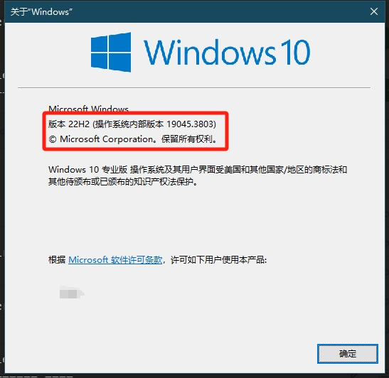

## 1. Introduction
This project is a high-privilege Windows kernel driver that modifies the computer's hardware IDs.

**Note: The author's Windows version is 22H2**

[简体中文](README_zh.md) | English

## 2. Features
- **Disk**: Randomize the serial numbers of all disks
- **NIC**: Hide related network adapters
- **SmBios**: Randomize SmBios information. For customizing specific structures, refer to the reference manual
- **GPU**: Randomize the serial number of the graphics card

## 3. Principle
The principle of this project is to directly find the loaded hardware information memory values and modify them. Therefore, this approach has certain limitations, such as low compatibility, because the signature codes of different Windows kernel versions are inconsistent, but it is more secure.

## 4. Quick Start
1. Download this repository
2. Understand and modify all the signature codes to your own (if your Windows version is inconsistent with mine)
3. Compile the project using Visual Studio
4. There are multiple methods to load the driver. If you have your own private driver signing certificate, you can use self-signing; or if you are like me and don't have one, you can use driver mapping tools such as [kdmapper](https://github.com/TheCruZ/kdmapper) for loading.  


###### How to Check Your Windows Version 
Press `Win+R` to open the Run window, then type `winver` to see your Windows version. For example:

<p align="center">
  
</p>

**If you want to be lazy and your Windows version is consistent with mine, you can use the [Prebuild](/assets/HWIDSpoofer.sys) driver**


## 5. How to Find Signature Codes
For most people, what they may want to know is how to find the signature codes for their own computer version. First, you need to make the following preparations:
1. Use VMWare to install a virtual machine with the same kernel version as your host machine
2. Connect WinDbg to this virtual machine using pipes、 network or any method.

For example, if you want to find the signature code of a function called FunctionA, you can use the `u ModuleName!FunctionA` command to get its disassembly code. (u is the instruction, ModuleName is the module name the function belongs to, and FunctionA is the name of the function you are looking for). For instance, `u storport!RaidUnitRegisterInterfaces`. However, sometimes if a function is not found during the search, it is likely that the debug pdb file of its driver module has not been loaded. You need to use `.reload` to reload its module and use `lm` to check if the module exists.

[How to cache pdb files to local](https://stackoverflow.com/questions/30019889/how-to-set-up-symbols-in-windbg)

1. Case 1: *Find the address of the RaidUnitRegisterInterfaces function*
    ```
    0: kd> u RaidUnitRegisterInterfaces
    storport!RaidUnitRegisterInterfaces:
    fffff805`31ebbbd4 48895c2418      mov     qword ptr [rsp+18h],rbx
    fffff805`31ebbbd9 55              push    rbp
    fffff805`31ebbbda 56              push    rsi
    fffff805`31ebbbdb 57              push    rdi
    fffff805`31ebbbdc 4883ec50        sub     rsp,50h
    fffff805`31ebbbe0 8b4160          mov     eax,dword ptr [rcx+60h]
    fffff805`31ebbbe3 4c8d0de6fd0300  lea     r9,[storport!`string' (fffff805`31efb9d0)]
    fffff805`31ebbbea 488b5118        mov     rdx,qword ptr [rcx+18h]
    ```
    Currently, I directly locate the disassembly code of this RaidUnitRegisterInterfaces as shown above. You can see that the left side is the memory address such as `fffff80531ebbbd4`, the middle is the memory value displayed in bits such as `48 89 5c 24 18`, and the rightmost is its disassembly code such as `mov qword ptr [rsp+18h], rbx`. We can take this signature code for testing, `\x48\x89\x5c\x24\x00\x55\x56\x57\x48\x83\xec\x00\x8b\x41\x00\x4c\x8d`, and its mask is `xxxx?xxxxxx?xx?xx`. (Most of the search principles are similar, see detailed [implementation](/HWIDSpoofer/Utils.cpp)). After obtaining this, it may not be correct and needs to be tested first, because the search for this signature code is based on the nearest principle (the one closest to the module base address is matched first). If the signature of an address happens to be consistent with the signature of the address you are looking for (just like I say the one wearing a green hat at the meeting is Bob, there may be multiple people wearing green hats), it may not be the address you are looking for. You need to find it and then use windbg for verification.

2. Case 2: *Find this ndisGlobalFilterList*
    ```
    ndis!ndisReferenceFilterByHandle:
    fffff805`674194a0 48895c2408      mov     qword ptr [rsp+8],rbx
    fffff805`674194a5 4889742418      mov     qword ptr [rsp+18h],rsi
    fffff805`674194aa 88542410        mov     byte ptr [rsp+10h],dl
    fffff805`674194ae 57              push    rdi
    fffff805`674194af 4883ec20        sub     rsp,20h
    fffff805`674194b3 488bf9          mov     rdi,rcx
    fffff805`674194b6 33db            xor     ebx,ebx   // 24

    fffff805`674194b8 488d0d09b60700  lea     rcx,[ndis!ndisGlobalFilterListLock (fffff805`67494ac8)]
    fffff805`674194bf 4c8b1522a40800  mov     r10,qword ptr [ndis!_imp_KeAcquireSpinLockRaiseToDpc (fffff805`674a38e8)]
    fffff805`674194c6 e8054440fa      call    nt!KeAcquireSpinLockRaiseToDpc (fffff805`6181d8d0)
    fffff805`674194cb 408af0          mov     sil,al
    fffff805`674194ce 488b0543b00700  mov     rax,qword ptr [ndis!ndisGlobalFilterList (fffff805`67494518)]
    ```
    This *ndisGlobalFilterList* is a global linked list in the kernel that maintains a list of registered NDIS filter drivers in the system. This is not a function but a pointer, and it is not advisable to use the brute-force search context of Case 1 directly, because its context is not this assembly code, and its context changes significantly. Therefore, we need to first find a place in memory where this list is called, and then calculate the address of the list. For example, from the above figure, we know that at the `fffff805674194ce` address in the *ndisReferenceFilterByHandle* function, this list is called.
    
    First, we can locate the `fffff805674194ce` address by brute force like in Case 1, and get its memory value as `\x48\x8b\x05\x43\xb0\x07\x00`, where the **last four offset bytes** (fixed length 4) represent the jump parameter, and the remaining 3 bytes in the front are the assembly instructions.

    Formula for calculating the function address:
    $$
        Function Address = CallTailAddress + Offset = CallHeadAddress + InstructionLength + Offset
    $$
    - **CallTailAddress**: It is the address of the next byte after the last byte of the call instruction (i.e., the address of the first instruction of the next instruction, also known as the current value of the program counter RIP)
    - **CallHeadAddress**: It is the address of the first byte of the call instruction
    - **InstructionLength**: It is the total number of bytes of the call instruction, which is 7 bytes here, i.e., `7`.
    - **Offset**: It is the interpretation of the last four bits of the instruction as a Long type. In this example, it is `0x7b043`


    We can plug it into the formula: `0xfffff805674194ce + 0x7 + 0x7b043 = 0xfffff80567494518`
    It can be seen that it is consistent with the ndis!ndisGlobalFilterList address obtained from the program earlier.


**Summary**
As for my current methods of finding signature codes, there are two ways and two types.
1. If what you're looking for is a function, then you can directly find it using the `x + functionName`.
2. If what you're looking for is a global structure or variable instance address, then you need to find a place where this structure variable is called, and then calculate its actual address.

---
### 6. WinDbg Commands

1. Search Symbol:
    ```
    x *!*RaidUnitRegisterInterfaces*
    x storport!*RaidUnitRegisterInterfaces*
    ```

2. Disassembly function or address
   
    ```
    u storport!RaidUnitRegisterInterfaces
    u fffff805`66ebbbd4 
    u fffff805`66ebbbd4 L30
    ...
    ```
3. reload modules
    ```
    .reload
    ```
4. List Module info
   ```
   lm 
   ```
---

## 7. Disclaimer
The documentation and related content of this project are **for learning and research purposes only**. Neither the project nor the author guarantees the correctness, reliability, or other implied uses of the content. Users assume all risks arising from the use of the information in this project.

The author assumes no liability for any direct or indirect damages arising from the use of the content in this project. In any case, the author shall not be responsible or liable for any consequences or liabilities in any form arising from the use of the content in this project.

## 8. Reference
- [mutante](https://github.com/SamuelTulach/mutante.git)
- [hwid](https://github.com/btbd/hwid)
- [EASY-HWID-SPOOFER](https://github.com/FiYHer/EASY-HWID-SPOOFER)
- [Smbios manual](https://www.dmtf.org/standards/smbios)